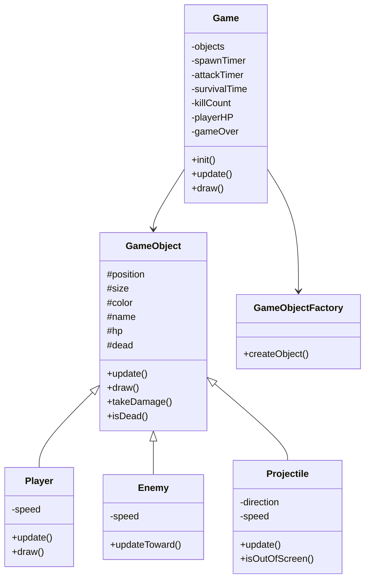

## UML Class Diagram

```mermaid
classDiagram

GameObject <|-- Player
GameObject <|-- Enemy
GameObject <|-- Projectile

Game --> GameObject
Game --> GameObjectFactory

class Game {
    -objects
    -spawnTimer
    -attackTimer
    -survivalTime
    -killCount
    -playerHP
    -gameOver
    +init()
    +update()
    +draw()
}

class GameObject {
    #position
    #size
    #color
    #name
    #hp
    #dead
    +update()
    +draw()
    +takeDamage()
    +isDead()
}

class Player {
    -speed
    +update()
    +draw()
}

class Enemy {
    -speed
    +updateToward()
}

class Projectile {
    -direction
    -speed
    +update()
    +isOutOfScreen()
}

class GameObjectFactory {
    +createObject()
}
```